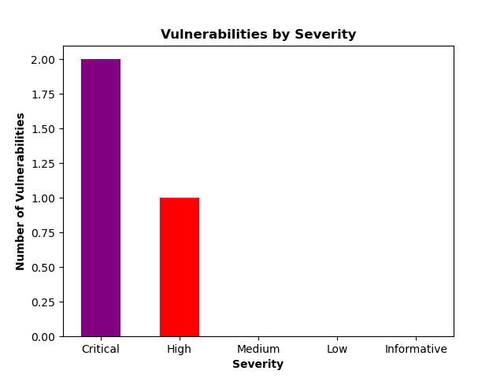

# Introduction
## Executive Summary

### Background
[Client Legal Name] (“Client” or “[Client Short Name]”) engaged Offport,  to perform an [insert type of test] on Client’s [internal/external/application’s] assets to identify potential security vulnerabilities. The assessment was conducted from [Assessment Start Date], to [Assessment End Date].

### Team

| Name | Role | Contact |
|----|----|---|
| First Last | Analyst | email1@corp.com |
| First Last | Senior Analyst | email2@corp.com |
| First Last | Senior Consultant | email3@corp.com |

### Scope

- 10.1.0.0/22
- 10.1.4.0/22

- 10.1.8.0/24
- 10.1.10.0/23

- 10.1.12.0/24
- 10.1.14.0/24

#### Scope Exclusions
Following reconnaissance of [Client Short Name]’s environment, the following domains were added to the scope of the assessment:

- 64.21.XXX.XXX
- 198.233.XXX.XXX	
- 64.21.XXX.XXX
- 20.40.XXX.X

### Limitations
- Time allowed for engagement [#Days]
- Disallowed attacks

### Summary of findings

The below table shows the total number of findings categorized by overall risk to the organization.

### Summary of Recommendations

The following recommendations provide direction on improving the overall security posture of networks and business-critical applications:

- Patch this
- Upgrade that
- Disable this

