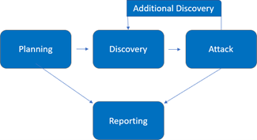

# Technical Details

## Methodology

All testing performed is based on the NIST SP 800-115 Technical Guide to Information Security Testing and Assessment, OWASP Testing Guide (v4), and customized testing frameworks.
Phases of penetration testing activities include the following:

- Planning – Customer goals are gathered and rules of engagement obtained.

- Discovery – Perform scanning and enumeration to identify potential vulnerabilities, weak areas, and exploits.

- Attack – Confirm potential vulnerabilities through exploitation and perform additional discovery upon new access.

- Reporting – Document all found vulnerabilities and exploits, failed attempts, and company strengths and weaknesses.





## Level of Access

For this assessment, Offport was provided local administrator credentials to a Microsoft Windows workstation on [Client Short Name]’s network

| Account	| Level of access |
|----|----|
| Admin 1	| Administrator user with full access to the system |
| Test account 1 |	Standard user with access to XYZ |
| Test account 2	| Standard user with access to ABC |

## Reconnaissance

**Scope validation**

External testing was conducted remotely from Offport facilities and by consultants using VPNs. [Client Short Name] provided Offport with a range of IP addresses to be used as potential targets for testing. Offport validated these ranges using whois data provided by the American Registry for Internet Numbers (“ARIN”).
Reviewing this information, Offport determined that several of the IP addresses were leased from different organizations, as seen below. Clent, however, confirmed that all of these IP addresses are in scope for the assessment.

```bash
for x in $(cat ept-cidrs.txt); do echo "[+]" $x; whois $x | tee -a whois-full.txt | grep -Ei 'Organization|OrgName|netname|descr|address|bal';done | tee whois.txt
```

**DNS enumeration**

Offport began testing by aggregating open-source intelligence (“OSINT”) on [Client Short Name]’s systems. OSINT data consists of information scraped from public resources that can be leveraged for enumerating and attacking in-scope systems. This type of intelligence gathering is often passively collected through nontarget resources, such as search engines. Offport leveraged several automated tools to perform data collection. Using the sublist3r  tool, Offport discovered several subdomain targets that fell within the provided scope.

```
sublist3r -d client.com -o sublisterOutput
...

# Confirming in-range targets
for x in $(cat sublist3r.txt); do echo $x; host $x; done
...

```

**User harvesting**

Continuing OSINT collection, Offport used BridgeKeeper  to scrape common search engines, LinkedIn, and other websites for employee names to generate potentially valid usernames. Using this technique, Offport identified several unique email addresses that could be used in further testing.

`python3 bridgekeeper.py --company “client” --domain client.com --depth 10`

**Network scanning**

Offport conducted reconnaissance throughout the assessment to help identify and enumerate external services and ensure that they were tested as part of the assessment. Offport performed active scanning against in-scope assets with Nmap  covering all Transmission Control Protocol (“TCP”) and User Datagram Protocol (“UDP”) ports. Service enumeration and operating system detection was also conducted with the same tools during this phase. This information was used to drive exploitation attempts and help Offport target potentially vulnerable assets.

`nmap -sSU -p 1-65535 -iL scope.txt -oA client`

